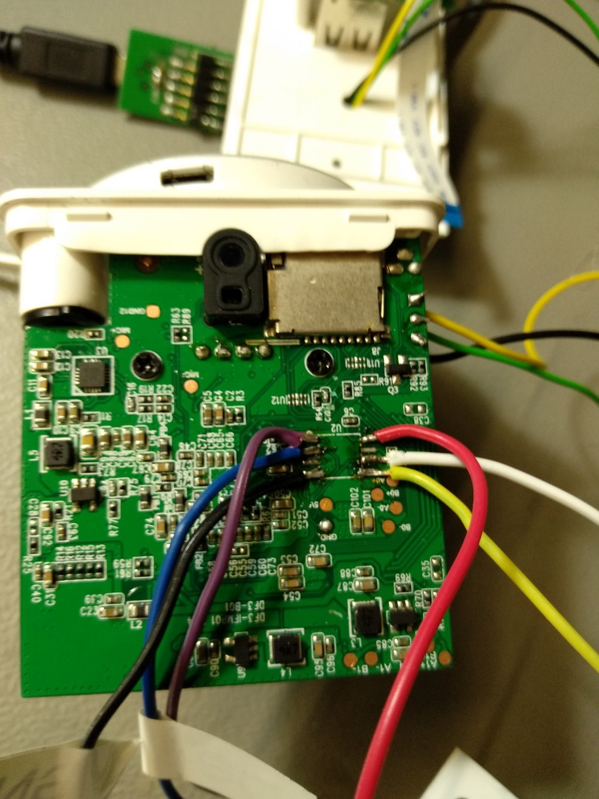
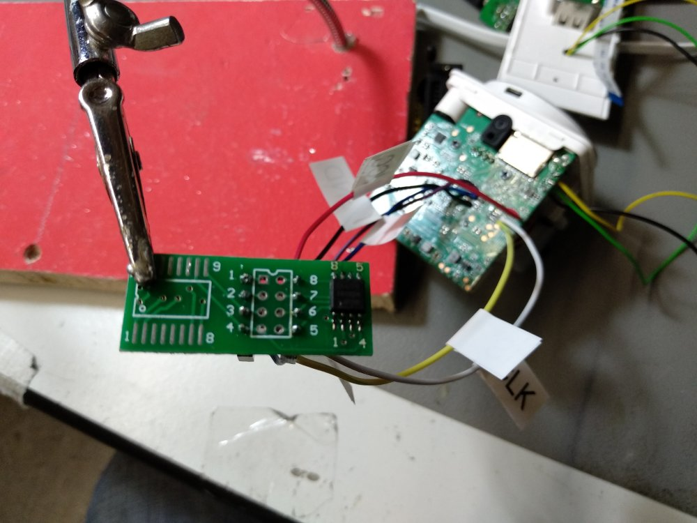
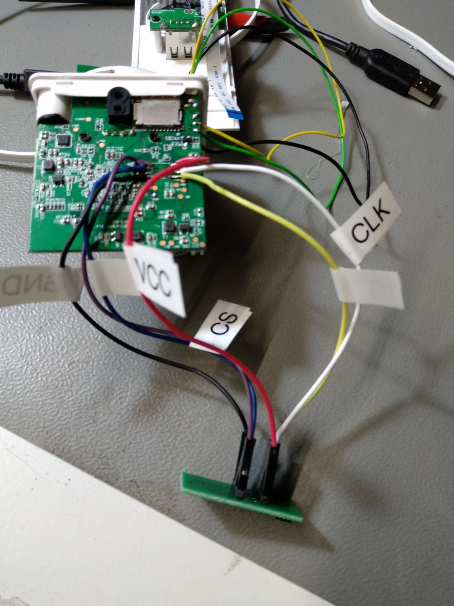

## Recovery from a dead u-boot

## Requirements
1. SPI-Nand Programmer. Just buy a Ch341
2. Decent soldering skills
3. Flashrom Software


### Flashing the u-boot
1. Desolder the chip from the camera - it wont work with a clip-adapter, i tried!
2. Solder the chip to the flash pad. Use following datasheet to solder it right:
https://4donline.ihs.com/images/VipMasterIC/IC/ELMC/ELMCS00588/ELMCS00588-1.pdf

3. Get the uboot and prepare it for flashing:
```
cp -r uboot-fullhd.bin fullflash.bin
dd if=/dev/zero of=fullflash.bin bs=1 count=1 seek=16777215
```

Next you can flash only the bootloader (it will take a while):

```

sudo flashrom -p ch341a_spi -n -V -c GD25Q128C --layout rom.layout --image boot -w fullflash.bin

```


## Advanced Setup for development




