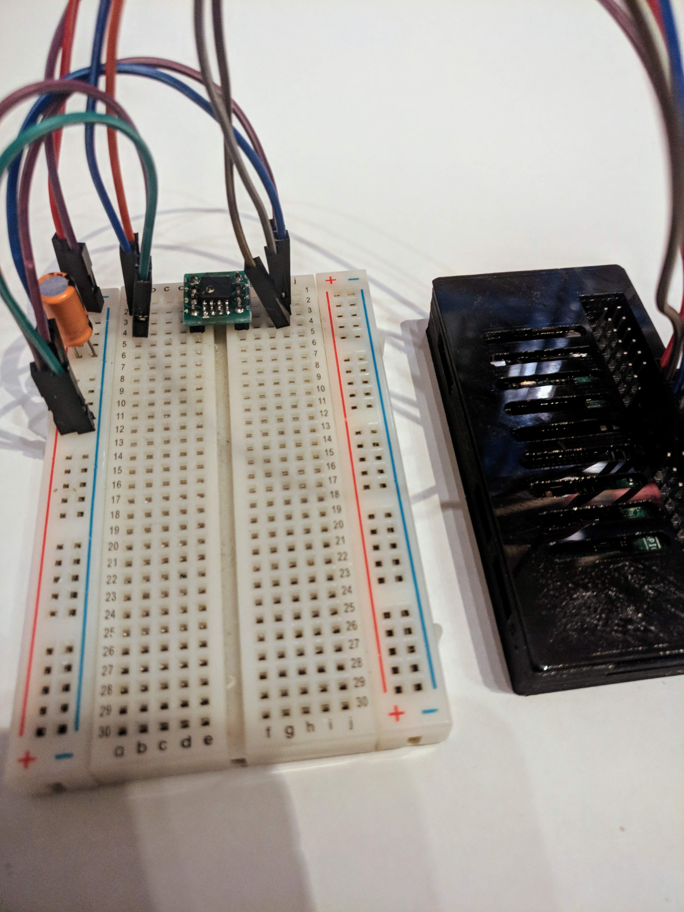
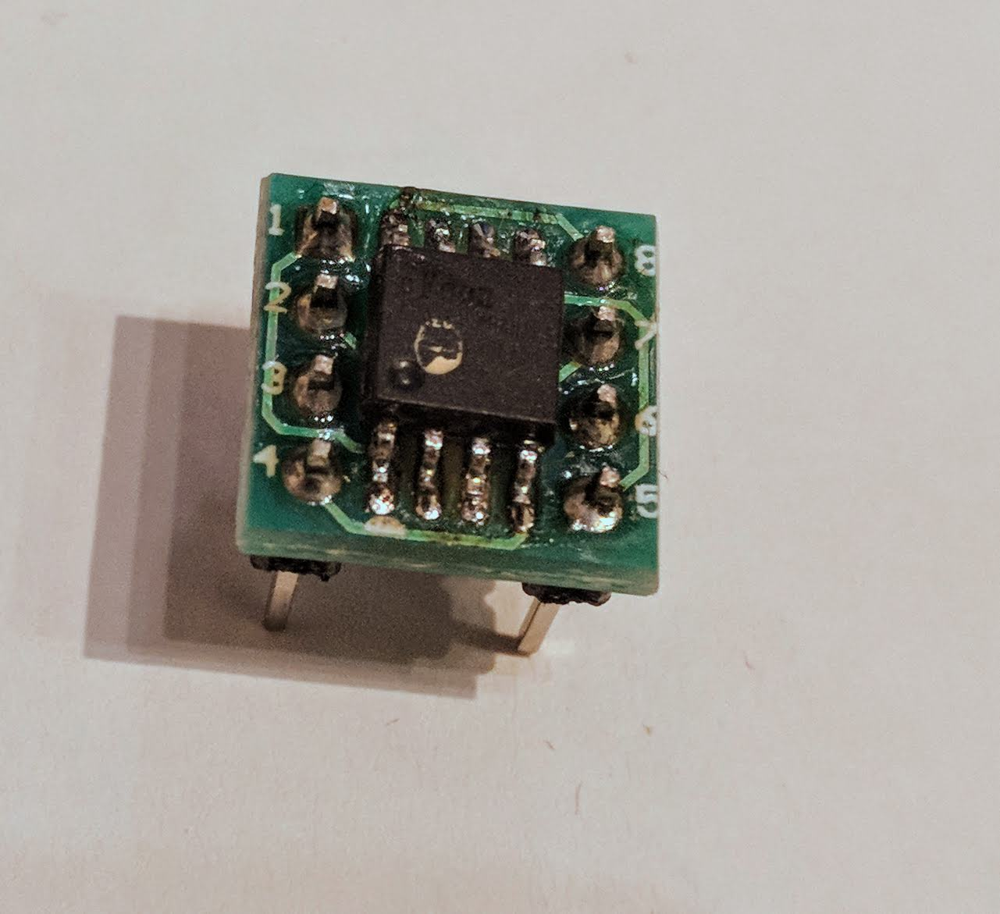
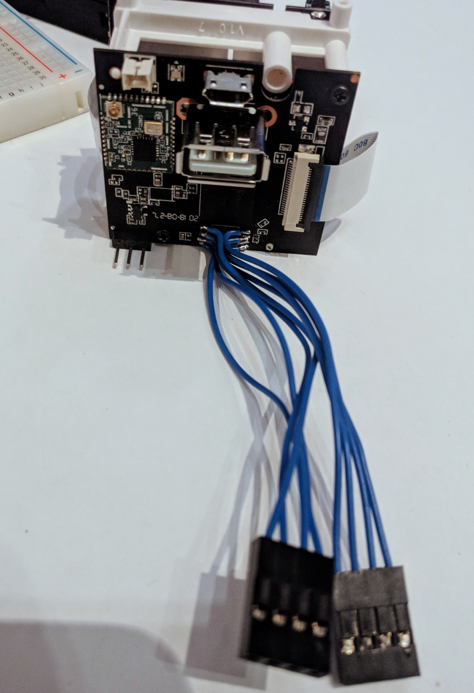

# Flashing a dead Xiaofang S1 with a Raspberry Pi

### Requirements
1. A Raspberry Pi
2. Decent soldering skills
3. (optional, recommended) some SOIC8 to DIP Adapter like [this one](https://www.aliexpress.com/item/50PCS-SOP8-turn-DIP8-SOIC8-to-DIP8-IC-adapter-Socket-so8-tssop8-soic8-sop8-TO-dip8/32760528788.html) (non-sponsored link)
4. (optional) a 47uF capacitor (have read it somewhere that it could help, had used it in my final flash, the ones before failed mostly due to my selfmade adapter - a protoboard and magnet wire)

### Setting up the Pi
1. Update the package repository
```
sudo apt update
```
2. Install flashrom and raspi-config
```
sudo apt install flashrom raspi-config
```
3. Run `sudo raspi-config` and enable SPI

### Connecting
First of all, I recommend you [Pinout.xyz](https://pinout.xyz/pinout/spi) to look up the GPIOs on the Raspberry Pi.
For the Flash, on my Camera it was a [EN25QH128A](https://www.esmt.com.tw/upload/pdf/ESMT/datasheets/EN25QH128A(2T).pdf), so please check the linked datasheet for its pinout

#|EN25QH128A|#|Raspberry Pi
-|-|-|-
1 | `CS#` | 17 | `3V3`
2 | `DO` | 21 | `BCM 9 / MISO`
3 | `WP#` | 24 | `BCM8 / CE0`
4 | `VSS` | 25 | `GND`
5 | `DI` | 19 | `BCM10 / MOSI`
6 | `CLK` | 23 | `BCM11 / SCLK`
7 | `HOLD#` | 17 | `3V3`
8 | `VCC` | 17 | `3V3`

The Capacitor should be between 3V3 and GND

### Flashing
1. Prepare the bootloader
```
wget https://github.com/Dafang-Hacks/uboot/raw/master/compiled_bootloader/xiaofang1s_64mb_v2.bin
cp -r xiaofang1s_64mb_v2.bin fullflash.bin
dd if=/dev/zero of=fullflash.bin bs=1 count=1 seek=16777215
```
2. Flash the bootloader - this takes a while, go grab a coffee or three
```
sudo flashrom -p linux_spi:dev=/dev/spidev0.0,spispeed=100K -n -l rom.layout -i boot -w fullflash.bin
```
The parameters, so you don't have to look them up yourself
`-p` specifies the programmer, we're using the SPI output of the Pi, it worked with an spispeed of 100k for me
`-n` means noverify, I added this to save some time
`-l` loads the flash layout. It would even be possible to flash the other partitions. The flash layout is the same as for the other cameras
`-i` specifies the "partition" we want to flash to
`-w` specifies the file we want to flash

## Some Pictures of my setup

This is my wired up Raspberry Pi Zero W (should work with any other model too, just had this one on my desk)


I soldered some wires to the camera and crimped some dupont connectors onto them so I can easily test the ROM after flashing, oh and you can also see the headers for the Serial Port
If you're testing the camera, keep in mind that you've disconnected the WiFi Antenna on disassembly